---
## Author
author:
  name: Ищенко Ирина Олеговна
  orcid: 0009-0002-0659-9651
  email: 1132226529@rudn.ru
  affiliation:
    - name: Российский университет дружбы народов
      country: Российская Федерация
      postal-code: 117198
      city: Москва
      address: ул. Миклухо-Маклая, д. 6
# Title
title: Лабораторная работа №3
subtitle: Компьютерный практикум по статистическому анализу данных
# Generic options
lang: ru-RU
crossref:
  lof-title: Список иллюстраций
  lot-title: Список таблиц
  lol-title: Листинги
# Formats
format:
## Pdf output format
  beamer:
    colorlinks: false
    toc-depth: 2
    slide_level: 2
    aspectratio: 169
    section-titles: true
    theme: metropolis
    colortheme: metropolis
    themeoptions: progressbar=frametitle,sectionpage=progressbar,numbering=fraction
    incremental: false
    mainfont: "IBM Plex Serif"
    sansfont: "IBM Plex Sans"
    monofont: "IBM Plex Mono"
## Language
    babel-lang: russian
    babel-otherlangs: english
## Html output
  revealjs:
    transition: slide
    margin: 0.2
    smaller: false
    output-ext: html
    theme: beige
    logo: _resources/image/logo_rudn.png
---

# Докладчик

:::::::::::::: {.columns align=center}
::: {.column width="65%"}

  * Ищенко Ирина Олеговна
  * уч. группа: НПИбд-01-22
  * Факультет физико-математических и естественных наук

:::
::: {.column width="30%"}

:::
::::::::::::::

# Цель работы

Основной целью работы является знакомство с NETEM — инструментом для тестирования производительности приложений в виртуальной сети, а также получение навыков проведения интерактивного и воспроизводимого экспериментов по измерению задержки и её дрожания (jitter) в моделируемой сети в среде Mininet.

# Задание

1. Задайте простейшую топологию, состоящую из двух хостов и коммутатора с назначенной по умолчанию mininet сетью 10.0.0.0/8.
2. Проведите интерактивные эксперименты по добавлению/изменению задержки, джиттера, значения корреляции для джиттера и задержки, распределения времени задержки в эмулируемой глобальной сети.
3. Реализуйте воспроизводимый эксперимент по заданию значения задержки в эмулируемой глобальной сети. Постройте график.
4. Самостоятельно реализуйте воспроизводимые эксперименты по изменению задержки, джиттера, значения корреляции для джиттера и задержки, распределения времени задержки в эмулируемой глобальной сети. Постройте графики.

# Выполнение лабораторной работы

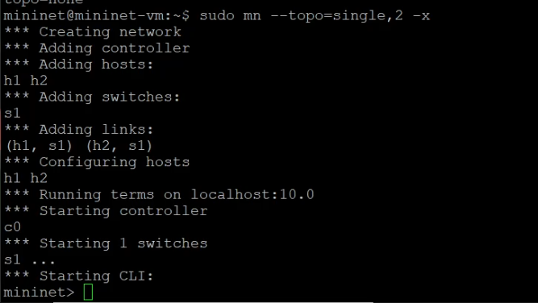{#fig-001 width=70%}

# ifconfig

{#fig-002 width=70%}

# Проверка подключения

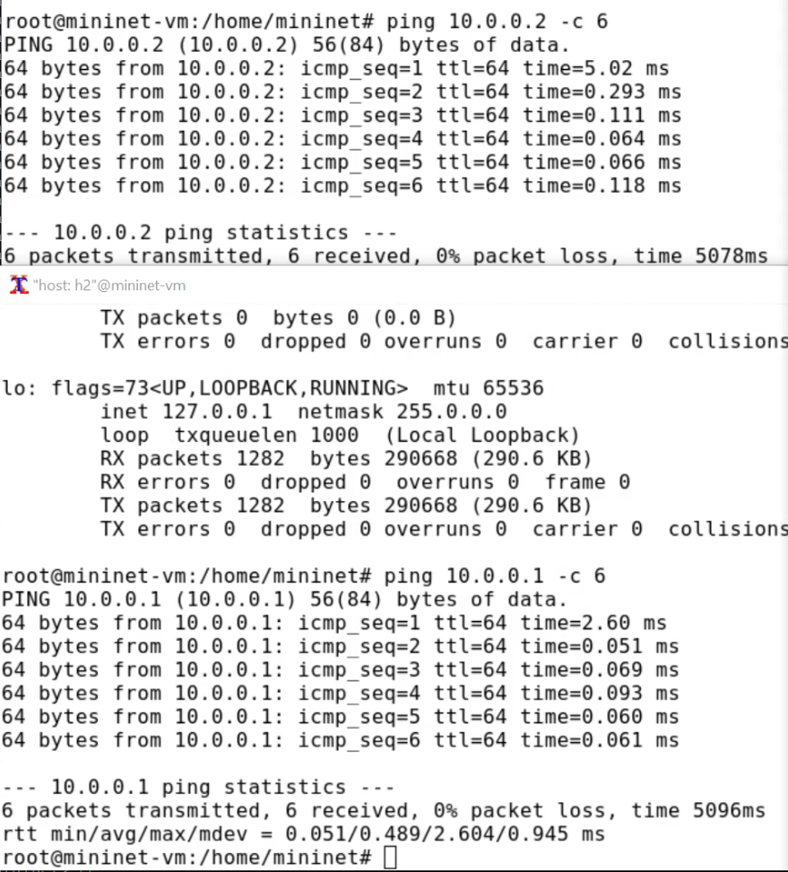{#fig-003 width=70%}

# Добавление/изменение задержки в эмулируемой глобальной сети

{#fig-004 width=70%}

# Добавление/изменение задержки в эмулируемой глобальной сети

{#fig-005 width=70%}

# Изменение задержки в эмулируемой глобальной сети

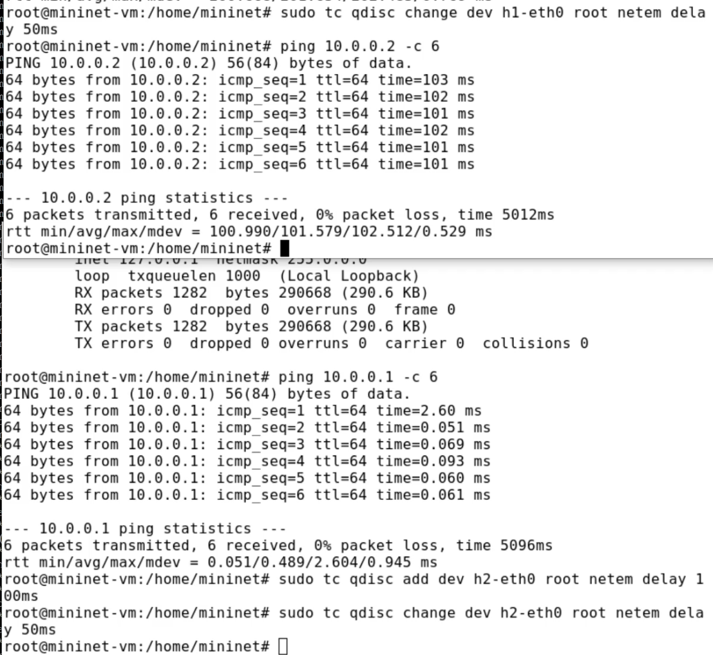{#fig-006 width=70%}

# Восстановление исходных значений (удаление правил) задержки в эмулируемой глобальной сети

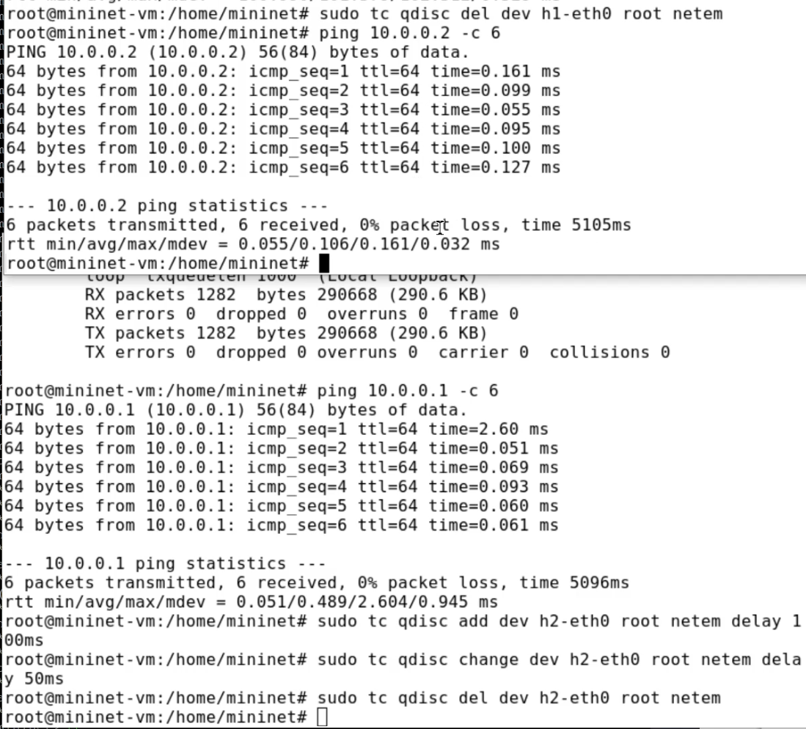{#fig-007 width=70%}

# Добавление значения дрожания задержки в интерфейс подключения к эмулируемой глобальной сети

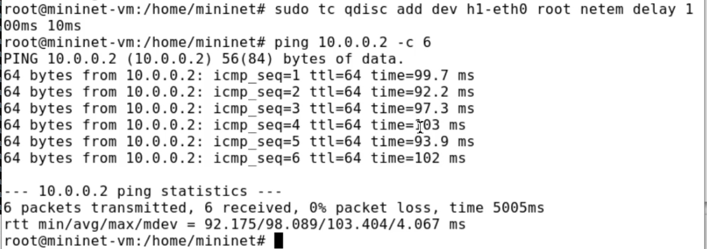{#fig-008 width=70%}

# Добавление значения корреляции для джиттера и задержки в интерфейс подключения к эмулируемой глобальной сети

{#fig-009 width=70%}

# Распределение задержки в интерфейсе подключения к эмулируемой глобальной сети

{#fig-010 width=70%}

# Топология

{#fig-011 width=70%}

# Визуализация

{#fig-012 width=70%}

# make

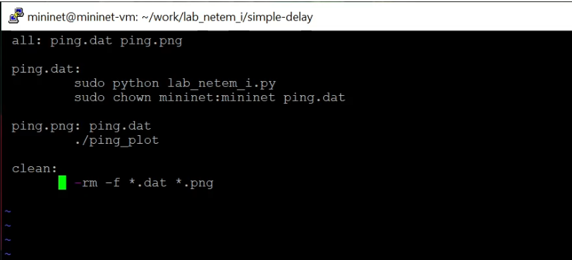{#fig-013 width=70%}

# График

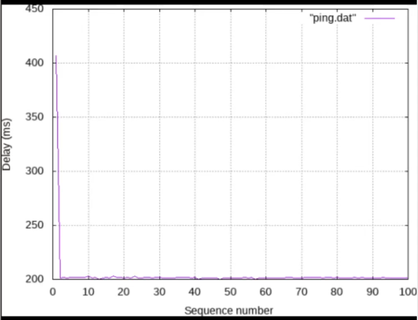{#fig-014 width=70%}

# График

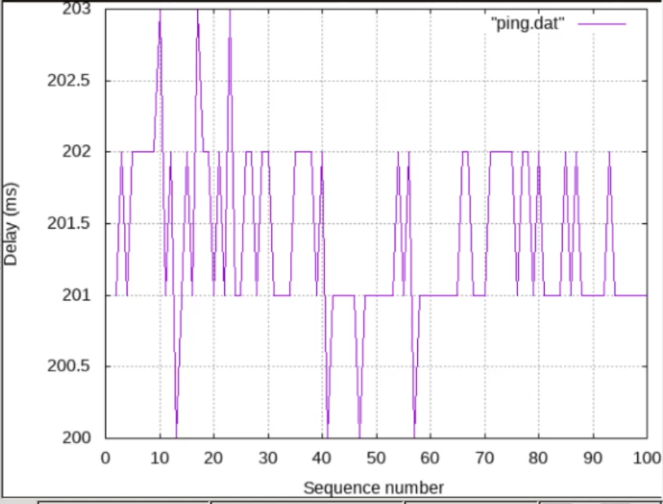{#fig-015 width=70%}

# Вычисления

{#fig-016 width=70%}

# make

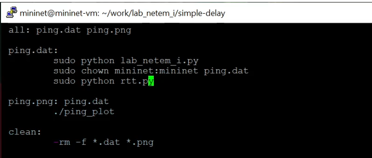{#fig-017 width=70%}

# Результат

{#fig-018 width=70%}

# change-delay 

{#fig-019 width=70%}

# change-delay 

{#fig-020 width=70%}

# jitter-delay

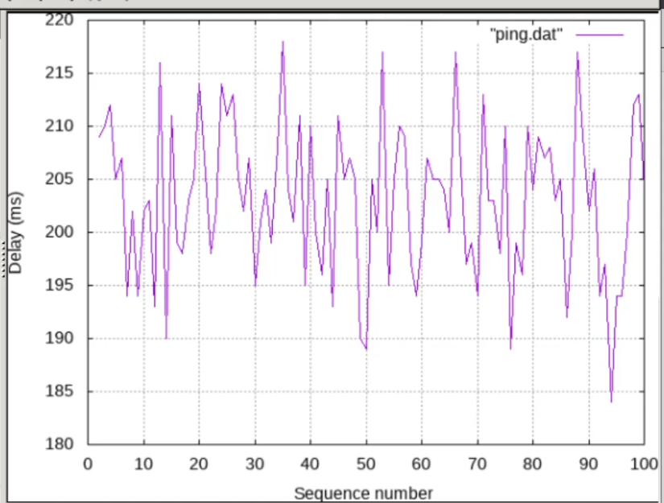{#fig-021 width=70%}

# jitter-delay

{#fig-022 width=70%}

# correlation-delay

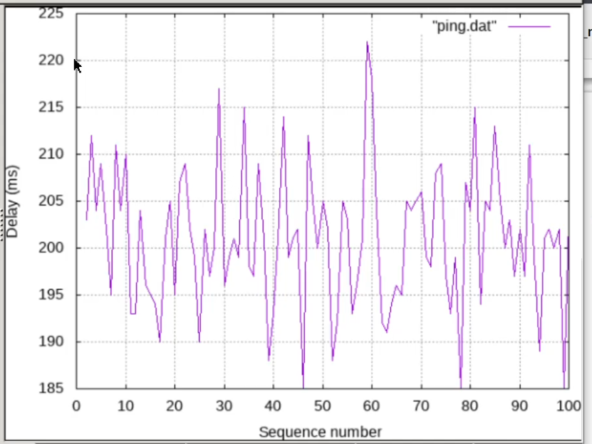{#fig-023 width=70%}

# correlation-delay

{#fig-024 width=70%}

# distribution-delay 

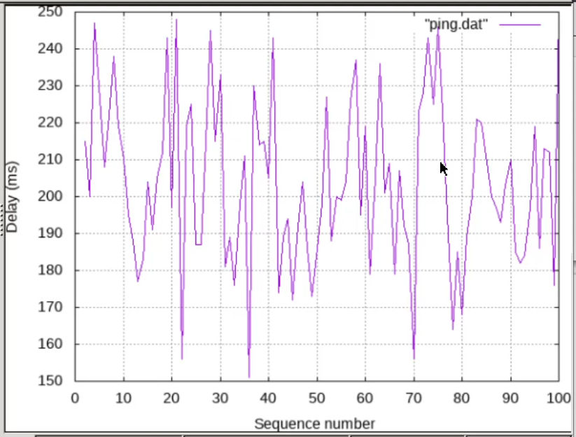{#fig-025 width=70%}

# distribution-delay

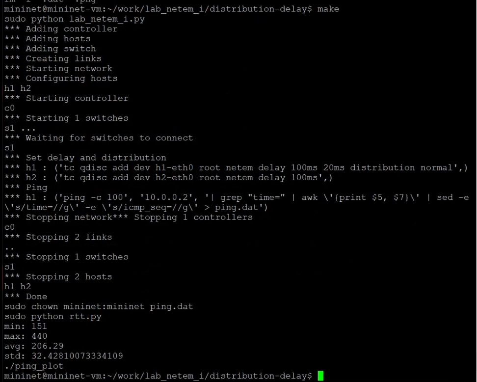{#fig-026 width=70%}

# Выводы

В ходе выполнения лабораторной работы я познакомилась с NETEM -- инструментом для тестирования производительности приложений в виртуальной сети, а также получила навыки проведения интерактивного и воспроизводимого экспериментов по измерению задержки и её дрожания (jitter) в моделируемой сети в среде Mininet.