---
## Author
author:
  name: Ищенко Ирина Олеговна
  orcid: 0009-0002-0659-9651
  email: 1132226529@rudn.ru
  affiliation:
    - name: Российский университет дружбы народов
      country: Российская Федерация
      postal-code: 117198
      city: Москва
      address: ул. Миклухо-Маклая, д. 6
## Title
title: "Отчёт по лабораторной работе №4"
subtitle: "Моделирование сетей передачи данных"
license: "CC BY"
## Generic options
lang: ru-RU
number-sections: true
toc: true
toc-title: "Содержание"
toc-depth: 2
## Crossref customization
crossref:
  lof-title: "Список иллюстраций"
  lot-title: "Список таблиц"
  lol-title: "Листинги"
## Bibliography
bibliography:
  - bib/cite.bib
csl: _resources/csl/gost-r-7-0-5-2008-numeric.csl
## Formats
format:
### Pdf output format
  pdf:
    toc: true
    number-sections: true
    colorlinks: false
    toc-depth: 2
    lof: true # List of figures
    lot: false # List of tables
#### Document
    documentclass: scrreprt
    papersize: a4
    fontsize: 12pt
    linestretch: 1.5
#### Language
    babel-lang: russian
    babel-otherlangs: english
#### Biblatex
    cite-method: biblatex
    biblio-style: gost-numeric
    biblatexoptions:
      - backend=biber
      - langhook=extras
      - autolang=other*
#### Misc options
    csquotes: true
    indent: true
    header-includes: |
      \usepackage{indentfirst}
      \usepackage{float}
      \floatplacement{figure}{H}
      \usepackage[math,RM={Scale=0.94},SS={Scale=0.94},SScon={Scale=0.94},TT={Scale=MatchLowercase,FakeStretch=0.9},DefaultFeatures={Ligatures=Common}]{plex-otf}
### Docx output format
  docx:
    toc: true
    number-sections: true
    toc-depth: 2
---

# Цель работы

Основной целью работы является знакомство с NETEM — инструментом для тестирования производительности приложений в виртуальной сети, а также получение навыков проведения интерактивного и воспроизводимого экспериментов по измерению задержки и её дрожания (jitter) в моделируемой сети в среде Mininet.

# Задание

1. Задайте простейшую топологию, состоящую из двух хостов и коммутатора с назначенной по умолчанию mininet сетью 10.0.0.0/8.
2. Проведите интерактивные эксперименты по добавлению/изменению задержки, джиттера, значения корреляции для джиттера и задержки, распределения времени задержки в эмулируемой глобальной сети.
3. Реализуйте воспроизводимый эксперимент по заданию значения задержки в эмулируемой глобальной сети. Постройте график.
4. Самостоятельно реализуйте воспроизводимые эксперименты по изменению задержки, джиттера, значения корреляции для джиттера и задержки, распределения времени задержки в эмулируемой глобальной сети. Постройте графики.

# Выполнение лабораторной работы

Запустим виртуальную среду с mininet. Из основной ОС подключимся к виртуальной машине. В виртуальной машине mininet при необходимости исправим права запуска X-соединения. Скопируем значение куки (MIT magic cookie) своего пользователя mininet в файл для пользователя root.

Зададим простейшую топологию, состоящую из двух хостов и коммутатора с назначенной по умолчанию mininet сетью 10.0.0.0/8 ([@fig-001]).

После введения этой команды запустятся терминалы двух хостов, коммутатора и контроллера. Терминалы коммутатора и контроллера можно закрыть.

{#fig-001 width=70%}

На хостах h1 и h2 введем команду ifconfig, чтобы отобразить информацию, относящуюся к их сетевым интерфейсам и назначенным им IP-адресам. В дальнейшем при работе с NETEM и командой tc будут использоваться интерфейсы h1-eth0 и h2-eth0 ([@fig-002]).

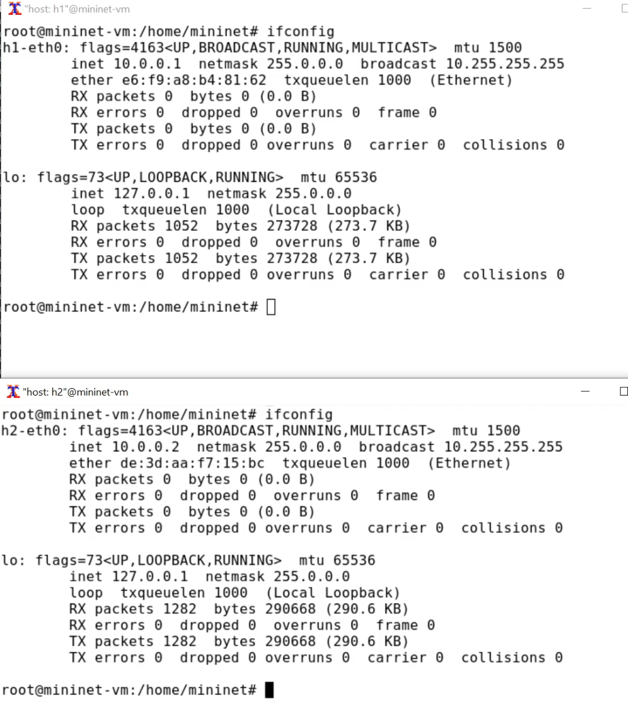{#fig-002 width=70%}

Проверим подключение между хостами h1 и h2 с помощью команды ping с параметром -c 6 ([@fig-003]).

{#fig-003 width=70%}

## Добавление/изменение задержки в эмулируемой глобальной сети

На хосте h1 добавим задержку в 100 мс к выходному интерфейсу ([@fig-004]).

`sudo tc qdisc add dev h1-eth0 root netem delay 100ms`

- sudo: выполнить команду с более высокими привилегиями;
- tc: вызвать управление трафиком Linux;
- qdisc: изменить дисциплину очередей сетевого планировщика;
- add: создать новое правило;
- dev h1-eth0: указать интерфейс, на котором будет применяться правило;
- netem: использовать эмулятор сети;
- delay 100ms: задержка ввода 100 мс.

Проверим, что соединение от хоста h1 к хосту h2 имеет задержку 100 мс, используя команду ping с параметром -c 6 с хоста h1. Минимальное - (100.404), среднее - (101.004), максимальное - (102.023), стандартное отклонение времени (0.611) приема-передачи.

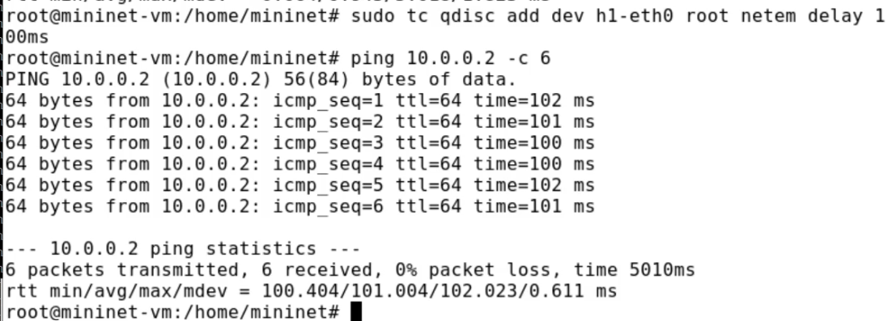{#fig-004 width=70%}

Для эмуляции глобальной сети с двунаправленной задержкой необходимо к соответствующему интерфейсу на хосте h2 также добавим задержку в 100 миллисекунд ([@fig-005]).

Проверим, что соединение между хостом h1 и хостом h2 имеет RTT в 200 мс (100 мс от хоста h1 к хосту h2 и 100 мс от хоста h2 к хосту h1), повторив команду ping с параметром -c 6 на терминале хоста h1. Минимальное - (200.668), среднее - (201.654), максимальное - (202.485), стандартное отклонение времени (0.769) приема-передачи.

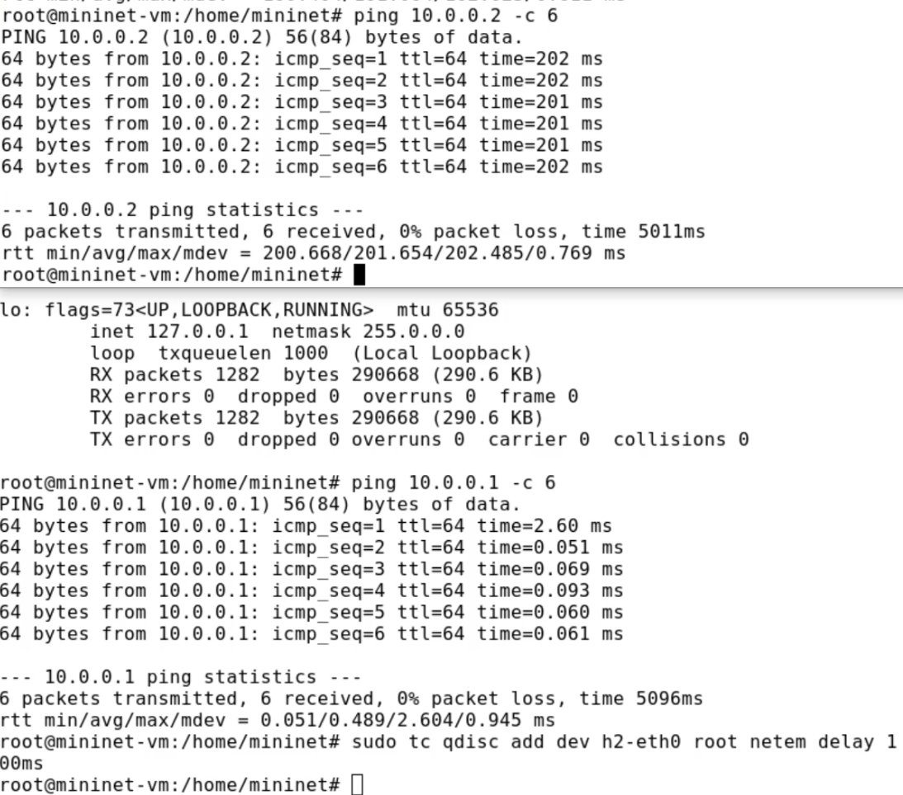{#fig-005 width=70%}

## Изменение задержки в эмулируемой глобальной сети

Изменим задержку со 100 мс до 50 мс для отправителя h1 и для получателя h2 ([@fig-006]).

Проверим, что соединение от хоста h1 к хосту h2 имеет задержку 100 мс, используя команду ping с параметром -c 6 с терминала хоста h1.
Минимальное - (100.990), среднее - (101.579), максимальное - (102.512), стандартное отклонение времени (0.529) приема-передачи.

{#fig-006 width=70%}

## Восстановление исходных значений (удаление правил) задержки в эмулируемой глобальной сети

Восстановим конфигурацию по умолчанию, удалив все правила, применённые к сетевому планировщику соответствующего интерфейса для
отправителя h1 и для получателя h2. Проверим, что соединение между хостом h1 и хостом h2 не имеет явно
установленной задержки, используя команду ping с параметром -c 6 с терминала хоста h1 ([@fig-007]). Минимальное - (0.055), среднее - (0.106), максимальное - (0.161), стандартное отклонение времени (0.032) приема-передачи.

{#fig-007 width=70%}

## Добавление значения дрожания задержки в интерфейс подключения к эмулируемой глобальной сети

Добавим на узле h1 задержку в 100 мс со случайным отклонением 10 мс. Проверим, что соединение от хоста h1 к хосту h2 имеет задержку 100 мс со случайным отклонением ±10 мс, используя в терминале хоста h1 команду ping с параметром -c 6. Минимальное - (92.175), среднее - (98.089), максимальное - (103.404), стандартное отклонение времени (4.067) приема-передачи.
Восстановим конфигурацию интерфейса по умолчанию на узле h1 ([@fig-008]).

{#fig-008 width=70%}

## Добавление значения корреляции для джиттера и задержки в интерфейс подключения к эмулируемой глобальной сети

Добавим на интерфейсе хоста h1 задержку в 100 мс с вариацией ±10 мс и значением корреляции в 25%. Убедимся, что все пакеты, покидающие устройство h1 на интерфейсе h1-eth0, будут иметь время задержки 100 мс со случайным отклонением ±10 мс, при этом время передачи следующего пакета зависит от предыдущего значения на 25%. Используем для этого в терминале хоста h1 команду ping с параметром -c 20. Минимальное - (92.802), среднее - (102.133), максимальное - (109.745), стандартное отклонение времени (5.578) приема-передачи. 
Восстановим конфигурацию интерфейса по умолчанию на узле h1 ([@fig-009]). 

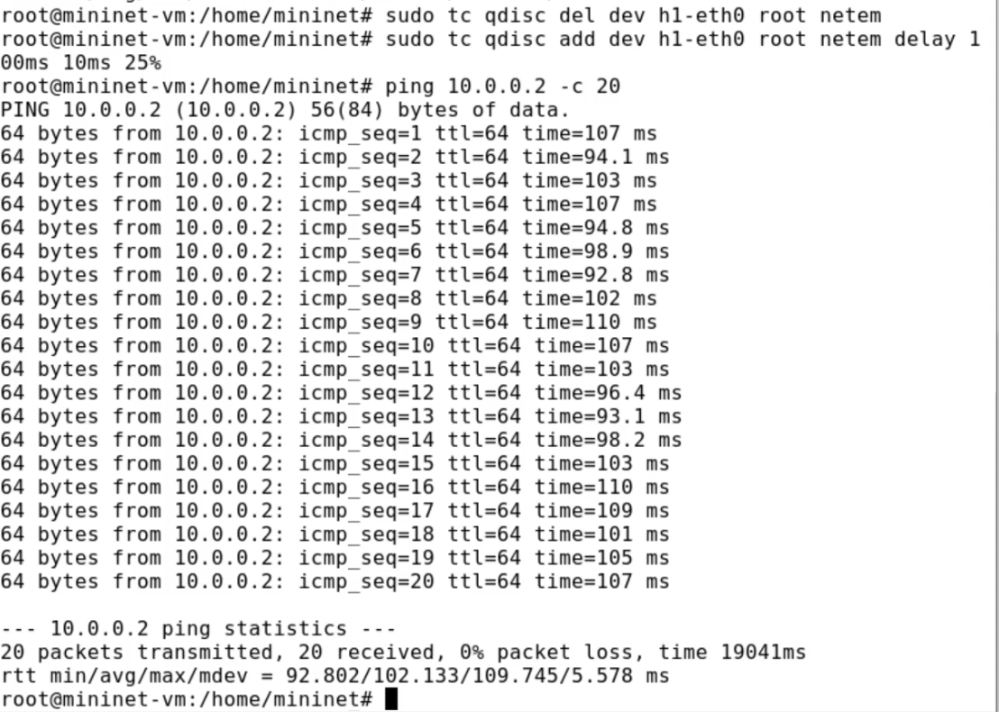{#fig-009 width=70%}

## Распределение задержки в интерфейсе подключения к эмулируемой глобальной сети

Зададим нормальное распределение задержки на узле h1 в эмулируемой сети.
Убедимся, что все пакеты, покидающие хост h1 на интерфейсе h1-eth0, будут иметь время задержки, которое распределено в диапазоне 100 мс ±20 мс. Используем для этого команду ping на терминале хоста h1 с параметром -c 10. Минимальное - (82.720), среднее - (105.785), максимальное - (129.487), стандартное отклонение времени (14.727) приема-передачи.
Восстановим конфигурацию интерфейса по умолчанию на узле h1. Завершим работу mininet в интерактивном режиме ([@fig-010]).

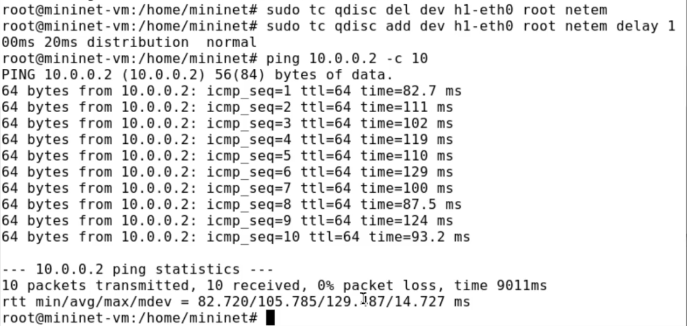{#fig-010 width=70%}

## Воспроизведение экспериментов. Добавление задержки для интерфейса, подключающегося к эмулируемой глобальной сети

С помощью API Mininet воспроизведем эксперимент по добавлению задержки для интерфейса хоста, подключающегося к эмулируемой глобальной сети.
В виртуальной среде mininet в своём рабочем каталоге с проектами создадим
каталог simple-delay и перейдем в него.

Создадим скрипт для эксперимента lab_netem_i.py([@fig-011]).

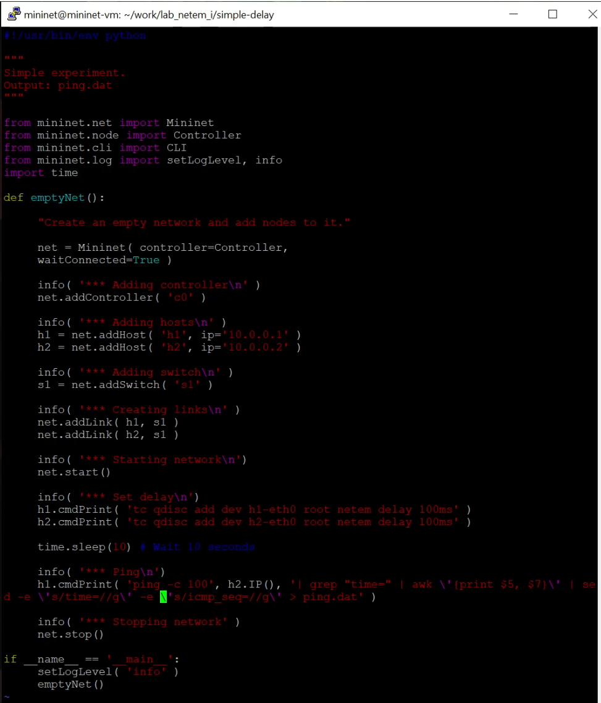{#fig-011 width=70%}

Создаём скрипт для визуализации ping_plot результатов эксперимента ([@fig-012]).

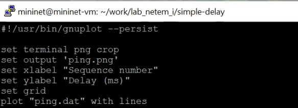{#fig-012 width=70%}

Зададим права доступа к файлу скрипта: `chmod +x ping_plot`.

Создадим Makefile для управления процессом проведения эксперимента ([@fig-013]).

{#fig-013 width=70%}

Выполним эксперимент. Продемонстрируем построенный в результате выполнения скриптов график ([@fig-014]).

{#fig-014 width=70%}

Из файла ping.dat удалим первую строку и заново постройте график.
Продемонстрируем построенный в результате график ([@fig-015]).

{#fig-015 width=70%}

Разработаем скрипт для вычисления на основе данных файла ping.dat минимального, среднего, максимального и стандартного отклонения времени приёма-передачи ([@fig-016]).

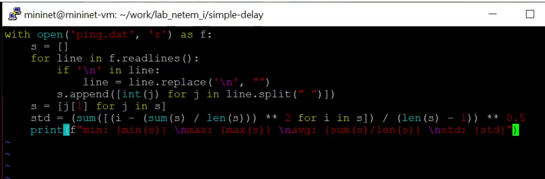{#fig-016 width=70%}

Добавим запуск скрипта в Makefile ([@fig-017]).

{#fig-017 width=70%}

Продемонстрируем работу скрипта с выводом значений на экран ([@fig-018]).

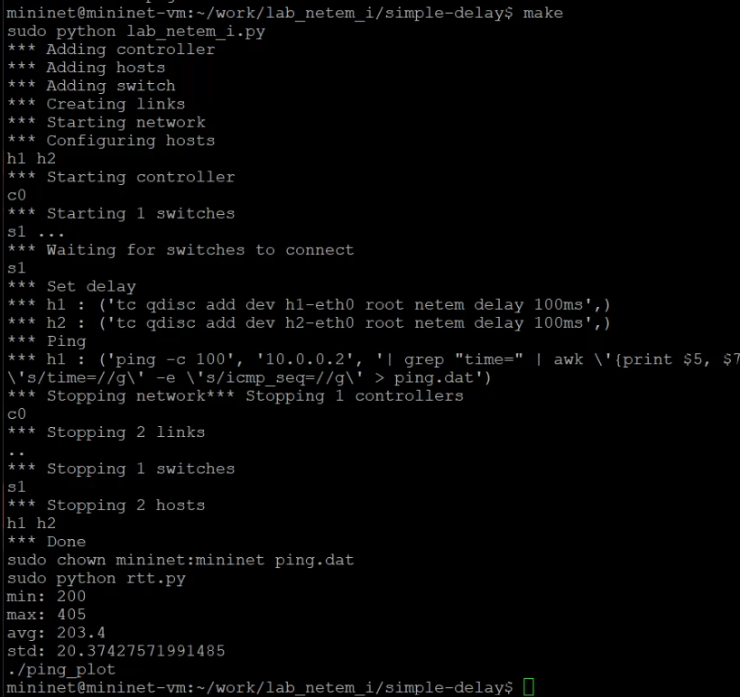{#fig-018 width=70%}

## Задание для самостоятельной работы

Реализуем воспроизводимые эксперименты по изменению задержки, джиттера, значения корреляции для джиттера и задержки, распределения времени задержки в эмулируемой глобальной сети. Создадим каталоги change-delay, jitter-delay, correlation-delay, distribution-delay. Скопируем скрипты, в скрипте топологии изменим строчки в зависимости от задачи. Построим графики. Вычислим минимальное, среднее, максимальное и стандартное отклонение времени приёма-передачи для каждого случая.

- change-delay ([рис. @fig-019]), ([рис. @fig-020]).

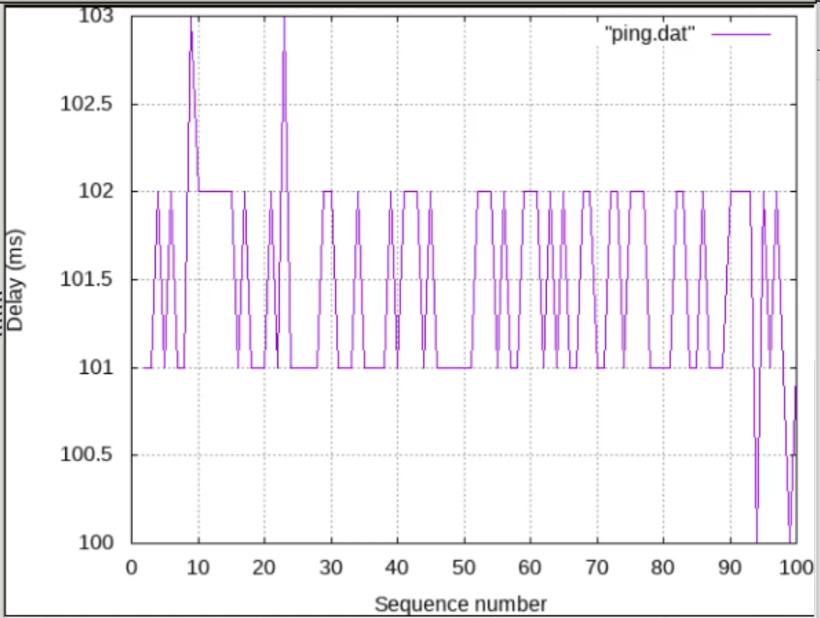{#fig-019 width=70%}

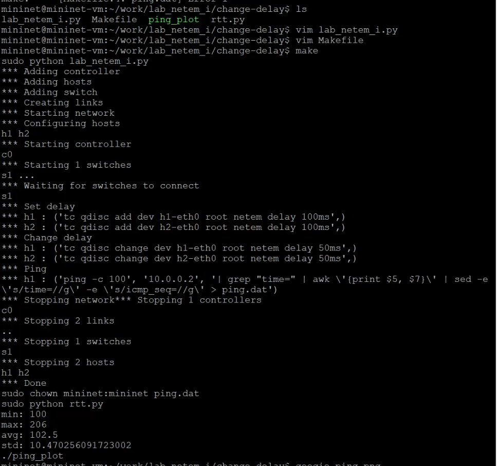{#fig-020 width=70%}

- jitter-delay ([рис. @fig-021]), ([рис. @fig-022]).

{#fig-021 width=70%}

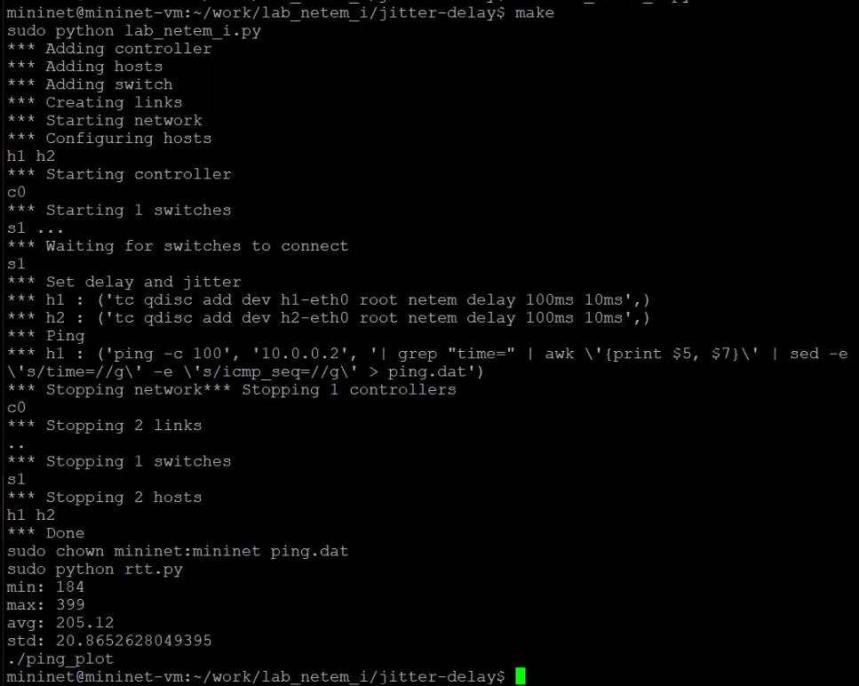{#fig-022 width=70%}

- correlation-delay ([рис. @fig-023]), ([рис. @fig-024]).

{#fig-023 width=70%}

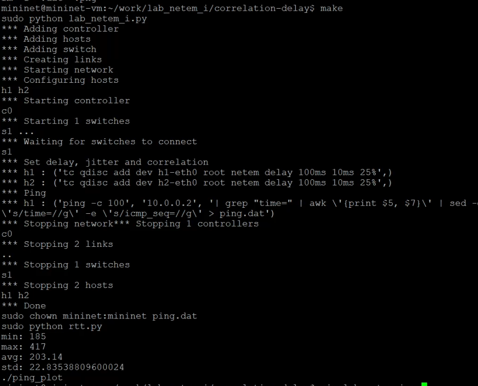{#fig-024 width=70%}

- distribution-delay ([рис. @fig-025]), ([рис. @fig-026]).

{#fig-025 width=70%}

{#fig-026 width=70%}

# Выводы

В ходе выполнения лабораторной работы я познакомилась с NETEM -- инструментом для тестирования производительности приложений в виртуальной сети, а также получила навыки проведения интерактивного и воспроизводимого экспериментов по измерению задержки и её дрожания (jitter) в моделируемой сети в среде Mininet.