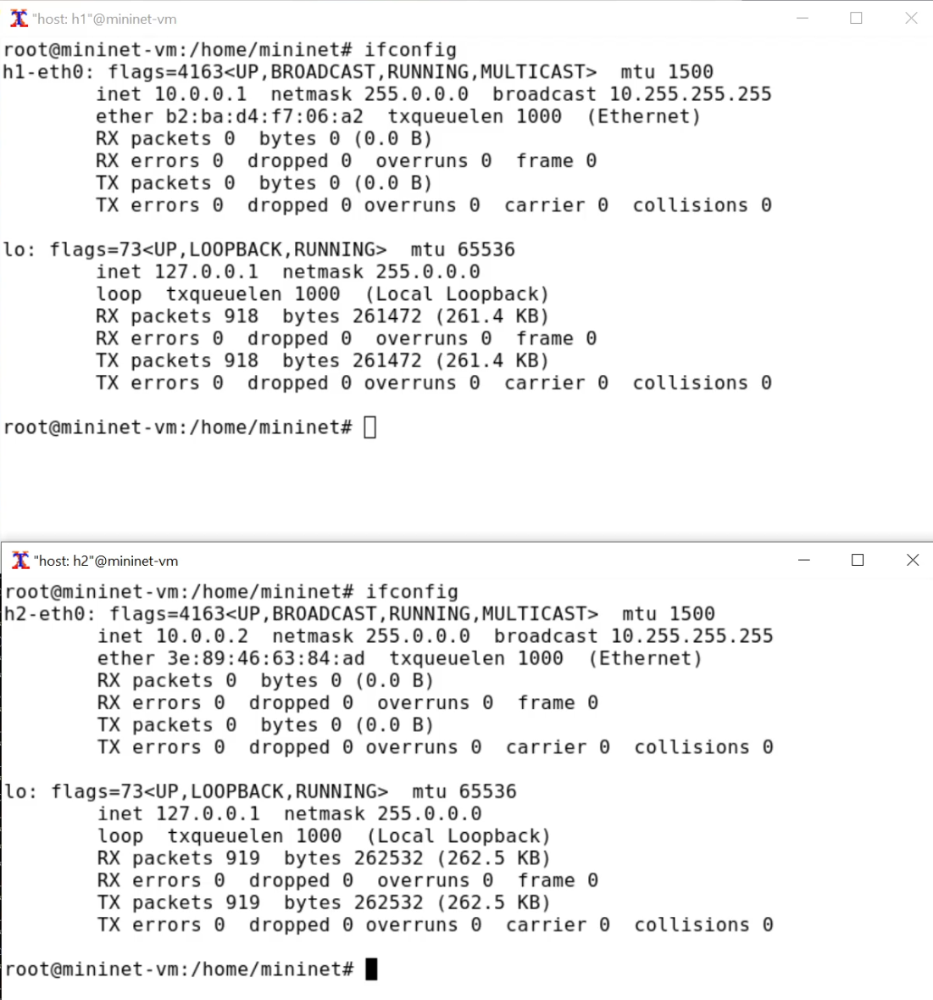
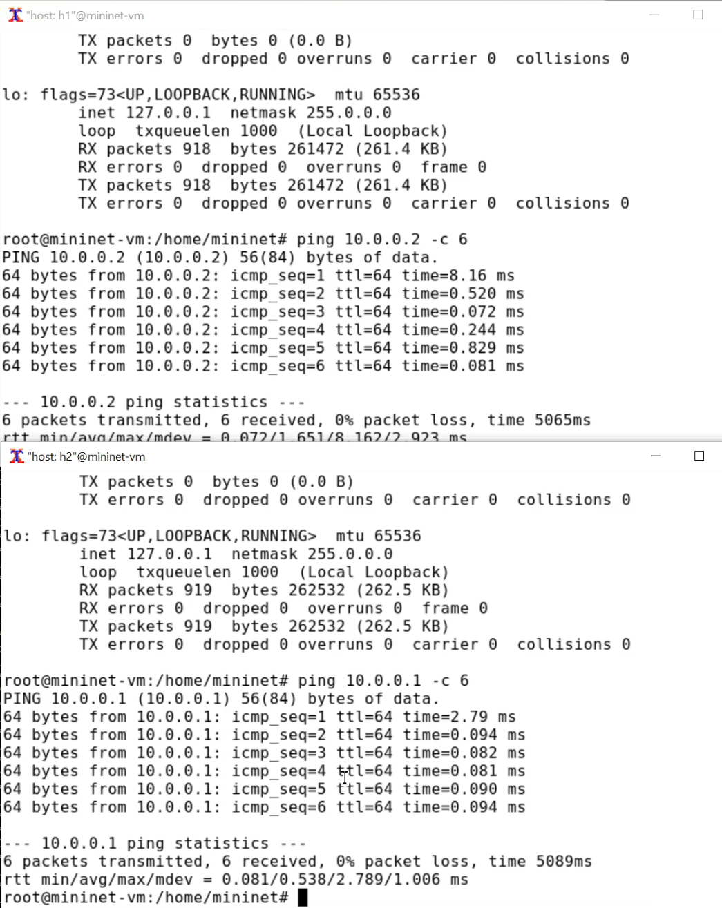
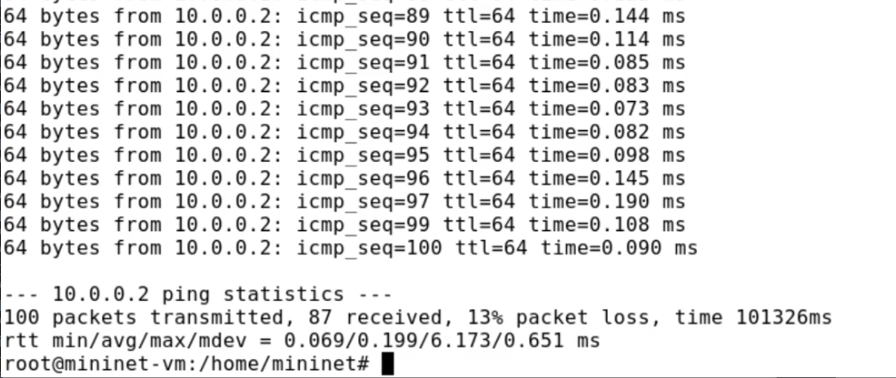
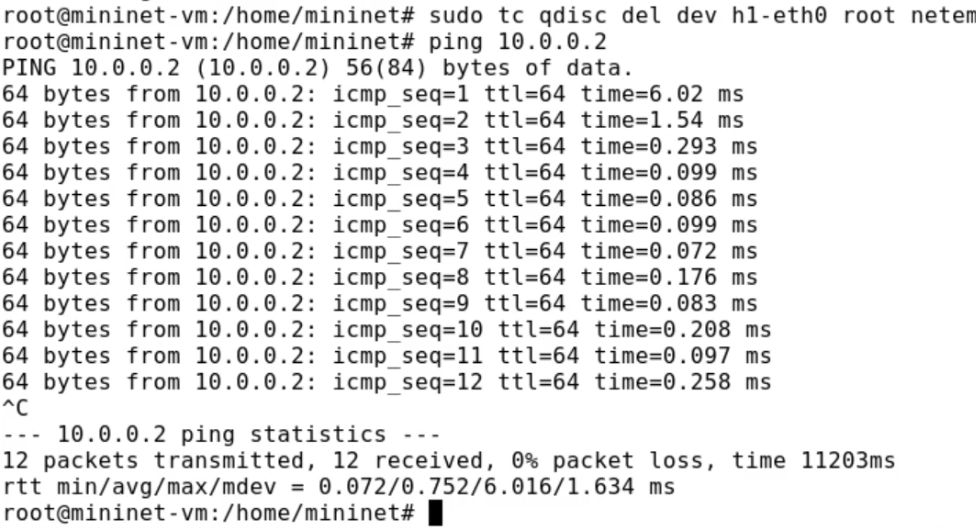
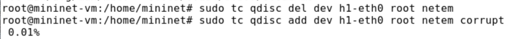
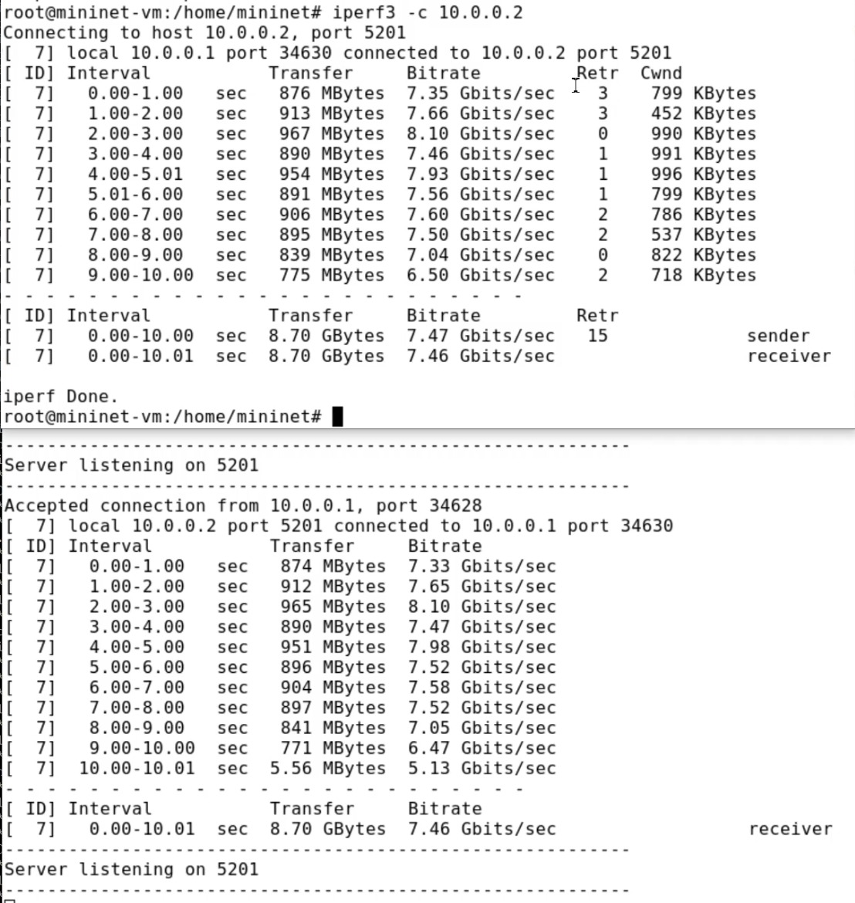
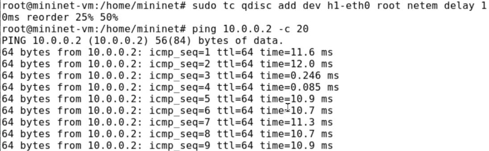
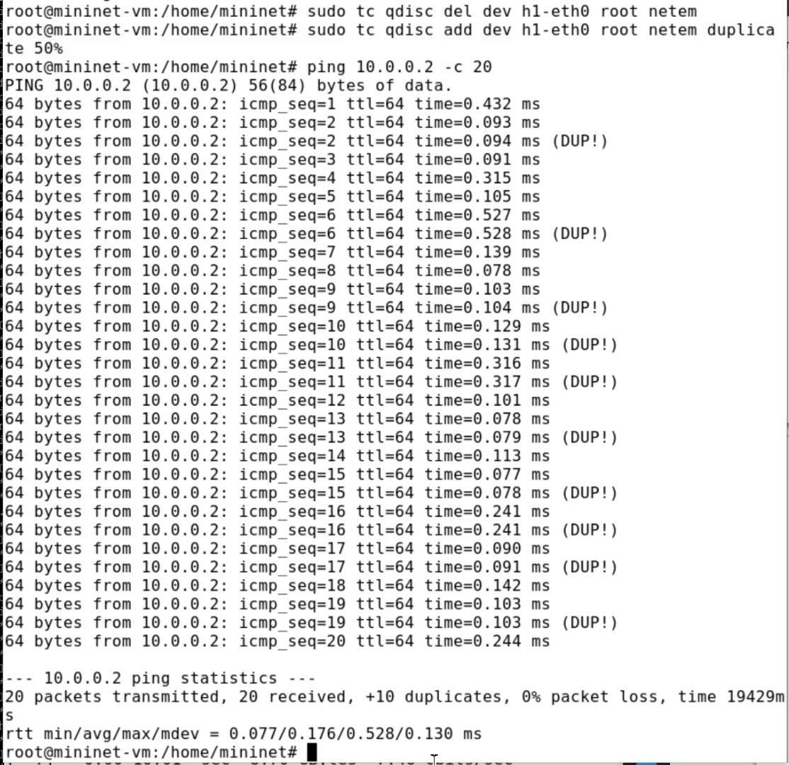
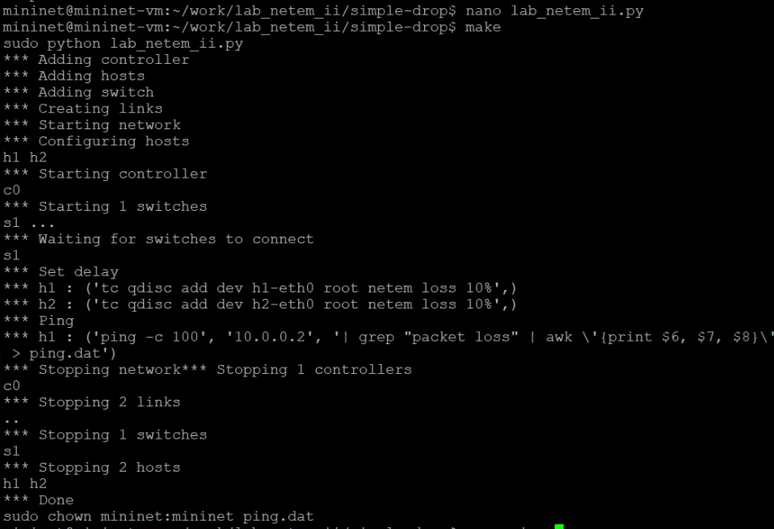
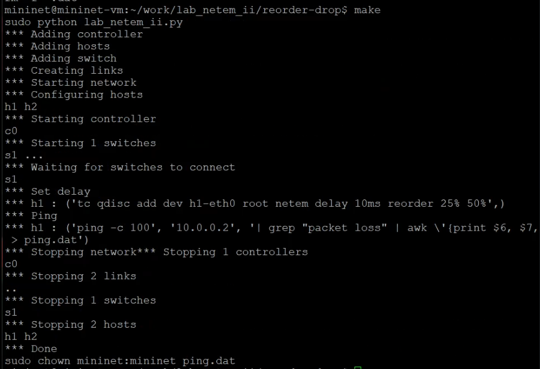

---
## Author
author:
  name: Ищенко Ирина Олеговна
  orcid: 0009-0002-0659-9651
  email: 1132226529@rudn.ru
  affiliation:
    - name: Российский университет дружбы народов
      country: Российская Федерация
      postal-code: 117198
      city: Москва
      address: ул. Миклухо-Маклая, д. 6
## Title
title: "Отчёт по лабораторной работе №5"
subtitle: "Моделирование сетей передачи данных"
license: "CC BY"
## Generic options
lang: ru-RU
number-sections: true
toc: true
toc-title: "Содержание"
toc-depth: 2
## Crossref customization
crossref:
  lof-title: "Список иллюстраций"
  lot-title: "Список таблиц"
  lol-title: "Листинги"
## Bibliography
bibliography:
  - bib/cite.bib
csl: _resources/csl/gost-r-7-0-5-2008-numeric.csl
## Formats
format:
### Pdf output format
  pdf:
    toc: true
    number-sections: true
    colorlinks: false
    toc-depth: 2
    lof: true # List of figures
    lot: false # List of tables
#### Document
    documentclass: scrreprt
    papersize: a4
    fontsize: 12pt
    linestretch: 1.5
#### Language
    babel-lang: russian
    babel-otherlangs: english
#### Biblatex
    cite-method: biblatex
    biblio-style: gost-numeric
    biblatexoptions:
      - backend=biber
      - langhook=extras
      - autolang=other*
#### Misc options
    csquotes: true
    indent: true
    header-includes: |
      \usepackage{indentfirst}
      \usepackage{float}
      \floatplacement{figure}{H}
      \usepackage[math,RM={Scale=0.94},SS={Scale=0.94},SScon={Scale=0.94},TT={Scale=MatchLowercase,FakeStretch=0.9},DefaultFeatures={Ligatures=Common}]{plex-otf}
### Docx output format
  docx:
    toc: true
    number-sections: true
    toc-depth: 2
---

# Цель работы

Основной целью работы является получение навыков проведения интерактивных экспериментов в среде Mininet по исследованию параметров сети, связанных с потерей, дублированием, изменением порядка и повреждением пакетов при передаче данных. Эти параметры влияют на производительность протоколов и сетей.

# Задание

1. Задайте простейшую топологию, состоящую из двух хостов и коммутатора с назначенной по умолчанию mininet сетью 10.0.0.0/8.
2. Проведите интерактивные эксперименты по по исследованию параметров сети, связанных с потерей, дублированием, изменением порядка и повреждением пакетов при передаче данных.
3. Реализуйте воспроизводимый эксперимент по добавлению правила отбрасывания пакетов в эмулируемой глобальной сети.
4. Самостоятельно реализуйте воспроизводимые эксперименты по исследованию параметров сети, связанных с потерей, изменением порядка и повреждением пакетов при передаче данных. 

# Выполнение лабораторной работы

Зададим простейшую топологию, состоящую из двух хостов и коммутатора с назначенной по умолчанию mininet сетью 10.0.0.0/8. На хостах h1 и h2 введем команду ifconfig, чтобы отобразить информацию, относящуюся к их сетевым интерфейсам и назначенным им IP-адресам.
В дальнейшем при работе с NETEM и командой tc будут использоваться интерфейсы h1-eth0 и h2-eth0 ([@fig-001]).

{#fig-001 width=70%}

Проверим подключение между хостами h1 и h2 с помощью команды ping с параметром -c 6 ([@fig-002]).  Минимальное отклонение: 0.081мс, среднее: 0.538мс, максимальное: 2.789мс и стандартное отклонение: 1.006мс времени приёма-передачи (RTT). Потери данных нет.

{#fig-002 width=70%}

Пакеты могут быть потеряны в процессе передачи из-за таких факторов, как
битовые ошибки и перегрузка сети. Скорость потери данных часто измеряется
как процентная доля потерянных пакетов по отношению к количеству отправленных пакетов.
На хосте h1 добавим 10% потерь пакетов к интерфейсу h1-eth0:

`sudo tc qdisc add dev h1-eth0 root netem loss 10%`

Здесь:

- sudo: выполнить команду с более высокими привилегиями;
- tc: вызвать управление трафиком Linux;
- qdisc: изменить дисциплину очередей сетевого планировщика;
- add: создать новое правило;
- dev h1-eth0: указать интерфейс, на котором будет применяться правило;
- netem: использовать эмулятор сети;
- loss 10%: 10% потерь пакетов.

Проверим, что на соединении от хоста h1 к хосту h2 имеются потери пакетов, используя команду ping с параметром -c 100 с хоста h1. Параметр -c указывает общее количество пакетов для отправки ([@fig-003]) и ([@fig-004]). Потеря пакетов: 13%.

{#fig-003 width=70%}

{#fig-004 width=70%}

Для эмуляции глобальной сети с потерей пакетов в обоих направлениях необходимо к соответствующему интерфейсу на хосте h2 также добавить 10% потерь пакетов.
Проверим, что соединение между хостом h1 и хостом h2 имеет больший процент потерянных данных (10% от хоста h1 к хосту h2 и 10% от хоста h2 к хосту h1), повторив команду ping с параметром -c 100 на терминале хоста h1 ([@fig-005]). Потеря пакетов: 14%.

{#fig-005 width=70%}

Удаляем правила и проверяем, что потери пакетов нет ([@fig-006]).

{#fig-006 width=70%}

Добавим на интерфейсе узла h1 коэффициент потери пакетов 50% (такой высокий уровень потери пакетов маловероятен), и каждая последующая вероятность зависит на 50% от последней: Проверим, что на соединении от хоста h1 к хосту h2 имеются потери пакетов, используя команду ping с параметром -c 50 с хоста h1 ([@fig-007]) и ([@fig-008]). Потеря пакетов: 62%.

{#fig-007 width=70%}

{#fig-008 width=70%}

Удалим правила.

Добавим на интерфейсе узла h1 0,01% повреждения пакетов. Проверим конфигурацию с помощью инструмента iPerf3 для проверки
повторных передач ([@fig-009]) и ([@fig-010]). Общее количество повторно переданных пакетов: 15.

{#fig-009 width=70%}

{#fig-010 width=70%}

Добавим на интерфейсе узла h1 следующее правило: 25% пакетов (со значением корреляции 50%) будут отправлены немедленно, а остальные 75% будут задержаны на 10 мс. Проверим, что на соединении от хоста h1 к хосту h2 имеются потери пакетов,
используя команду ping с параметром -c 20 с хоста h1. Убедимся, что часть пакетов не будут иметь задержки (один из четырех, или 25%), а последующие несколько пакетов будут иметь задержку около 10 миллисекунд (три из четырех, или 75%) ([@fig-011]) и ([@fig-012]).

{#fig-011 width=70%}

{#fig-012 width=70%}

Для интерфейса узла h1 зададим правило c дублированием 50% пакетов (т.е. 50% пакетов должны быть получены дважды):
Проверим, что на соединении от хоста h1 к хосту h2 имеются дублированные пакеты, используя команду ping с параметром -c 20 с хоста h1. Дубликаты пакетов помечаются как DUP! ([@fig-013]). Дупликатов: 10.

{#fig-013 width=70%}

В виртуальной среде mininet в своём рабочем каталоге с проектами создадим каталог simple-drop и перейдем в него.
Создадим скрипт для эксперимента lab_netem_ii.py ([@fig-014]).

{#fig-014 width=70%}

Скорректируем скрипт так, чтобы в отдельный файл выводилась информация о потерях пакетов. Создадим Makefile для управления процессом проведения эксперимента. Выполним эксперимент ([@fig-015]). Потеря пакетов: 14%.

{#fig-015 width=70%}

Создадим новую директория для эксепиремента по добавлению потери и коэффицента корреляции. Изменим скрипт и запустим ([@fig-016]). Потеря пакетов: 51%.

{#fig-016 width=70%}

Создадим новую директория для эксепиремента по изменению порядка пакетов. Изменим скрипт и запустим ([@fig-017]).

{#fig-017 width=70%}

Создадим новую директория для эксепиремента по повреждению пакетов. Изменим скрипт и запустим ([@fig-018]).

{#fig-018 width=70%}

# Выводы

В ходе выполнения лабораторной работы я получила навыки проведения интерактивных экспериментов в среде Mininet по исследованию параметров сети, связанных с потерей, дублированием, изменением порядка и повреждением пакетов при передаче данных.
