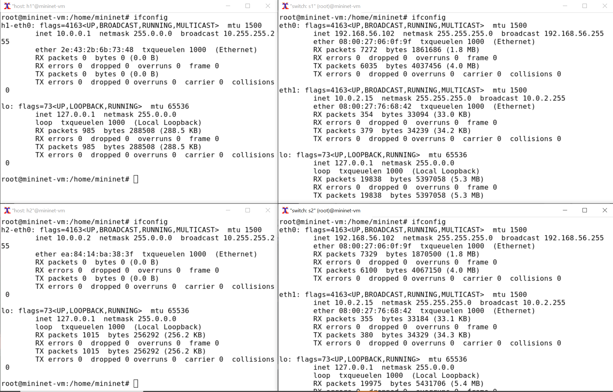
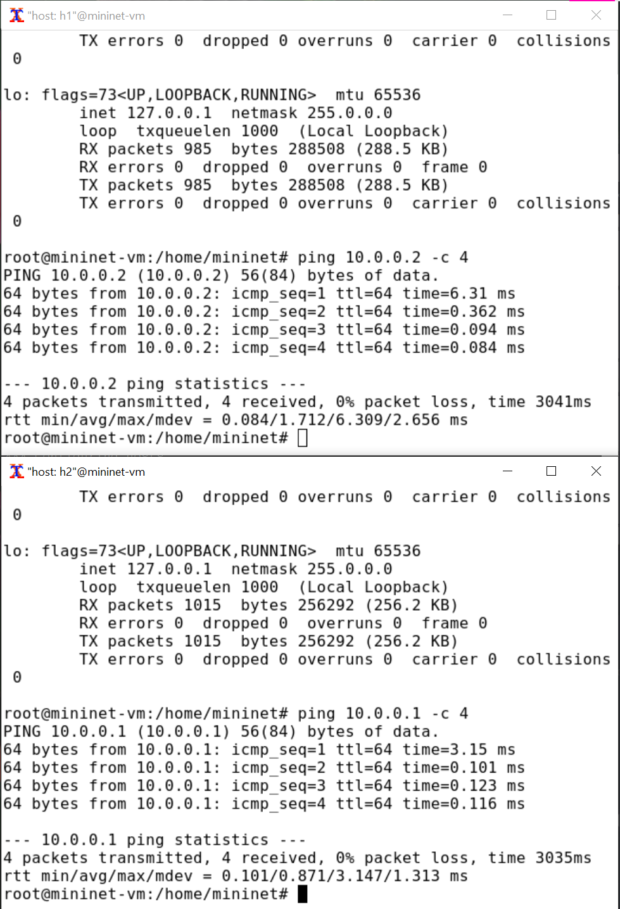
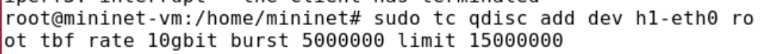
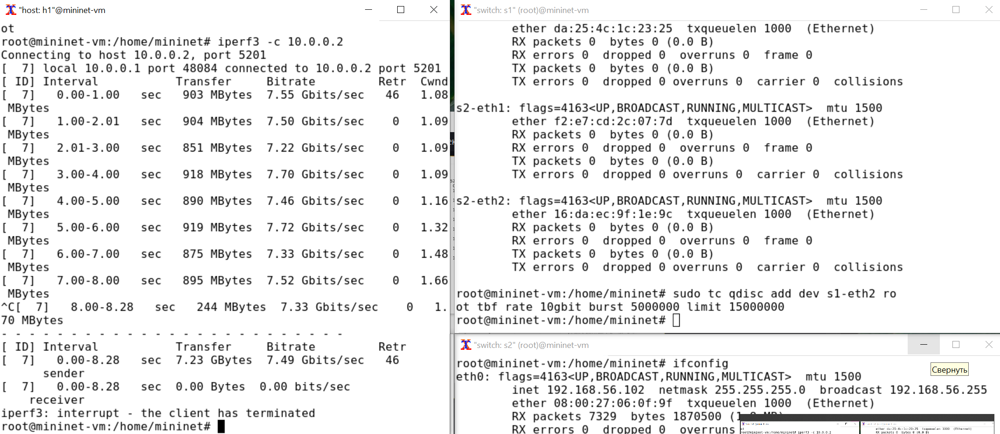
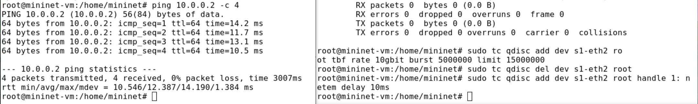
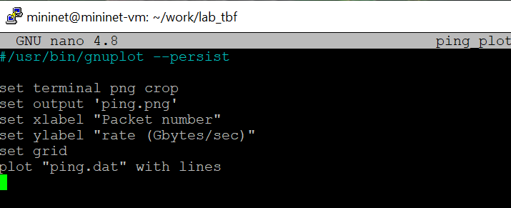
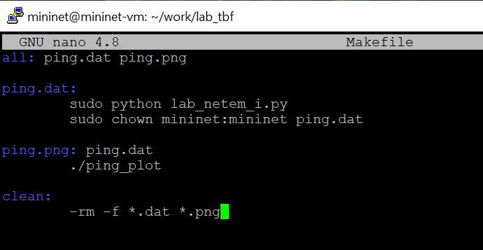
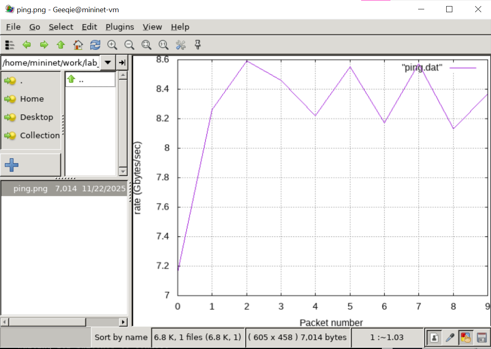

---
## Author
author:
  name: Ищенко Ирина Олеговна
  orcid: 0009-0002-0659-9651
  email: 1132226529@rudn.ru
  affiliation:
    - name: Российский университет дружбы народов
      country: Российская Федерация
      postal-code: 117198
      city: Москва
      address: ул. Миклухо-Маклая, д. 6
# Title
title: Лабораторная работа №6
subtitle: Моделирование сетей передачи данных
# Generic options
lang: ru-RU
crossref:
  lof-title: Список иллюстраций
  lot-title: Список таблиц
  lol-title: Листинги
# Formats
format:
## Pdf output format
  beamer:
    colorlinks: false
    toc-depth: 2
    slide_level: 2
    aspectratio: 169
    section-titles: true
    theme: metropolis
    colortheme: metropolis
    themeoptions: progressbar=frametitle,sectionpage=progressbar,numbering=fraction
    incremental: false
    mainfont: "IBM Plex Serif"
    sansfont: "IBM Plex Sans"
    monofont: "IBM Plex Mono"
## Language
    babel-lang: russian
    babel-otherlangs: english
## Html output
  revealjs:
    transition: slide
    margin: 0.2
    smaller: false
    output-ext: html
    theme: beige
    logo: _resources/image/logo_rudn.png
---
# Докладчик

:::::::::::::: {.columns align=center}
::: {.column width="65%"}

  * Ищенко Ирина Олеговна
  * уч. группа: НПИбд-01-22
  * Факультет физико-математических и естественных наук

:::
::: {.column width="30%"}

:::
::::::::::::::

# Цель работы

Основной целью работы является знакомство с принципами работы дисциплины очереди Token Bucket Filter, которая формирует входящий/исходящий
трафик для ограничения пропускной способности, а также получение навыков
моделирования и исследования поведения трафика посредством проведения
интерактивного и воспроизводимого экспериментов в Mininet.

# Задание

1. Задайте топологию, состоящую из двух хостов и двух коммутаторов
с назначенной по умолчанию mininet сетью 10.0.0.0/8.
2. Проведите интерактивные эксперименты по ограничению пропускной способности сети с помощью TBF в эмулируемой глобальной сети.
3. Самостоятельно реализуйте воспроизводимые эксперимент по применению
TBF для ограничения пропускной способности. Постройте соответствующие
графики.

# Выполнение лабораторной работы

{#fig-001 width=70%}

# Выполнение лабораторной работы

{#fig-002 width=70%}

# Выполнение лабораторной работы

{#fig-003 width=70%}

# Выполнение лабораторной работы

{#fig-004 width=70%}

# Выполнение лабораторной работы

{#fig-005 width=70%}

# Выполнение лабораторной работы

{#fig-006 width=70%}

# Выполнение лабораторной работы

{#fig-007 width=70%}

# Выполнение лабораторной работы

{#fig-008 width=70%}

# Выполнение лабораторной работы

{#fig-009 width=70%}

# Выполнение лабораторной работы

{#fig-010 width=70%}

# Выполнение лабораторной работы

{#fig-011 width=70%}

# Выполнение лабораторной работы

{#fig-012 width=70%}

# Выводы

В ходе выполнения лабораторной работы я познакомилась с принципами работы дисциплины очереди Token Bucket Filter, которая формирует входящий/исходящий трафик для ограничения пропускной способности, а также получила навыки
моделирования и исследования поведения трафика посредством проведения интерактивного и воспроизводимого экспериментов в Mininet.
