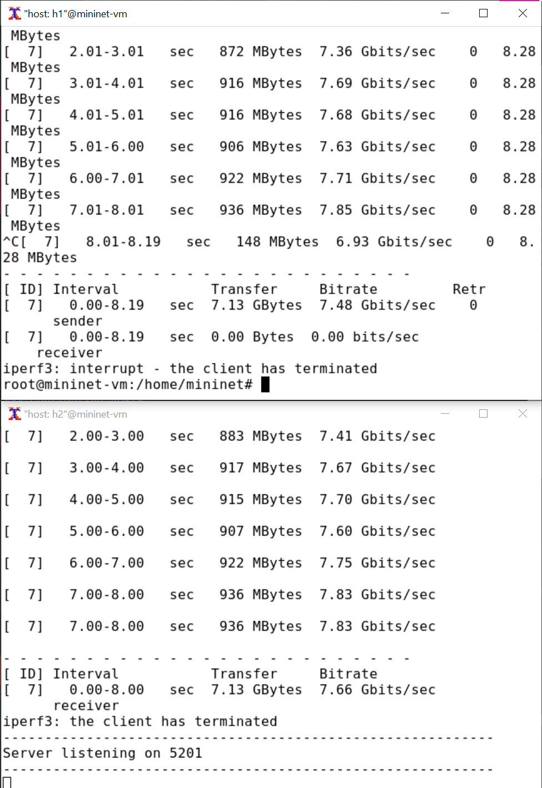
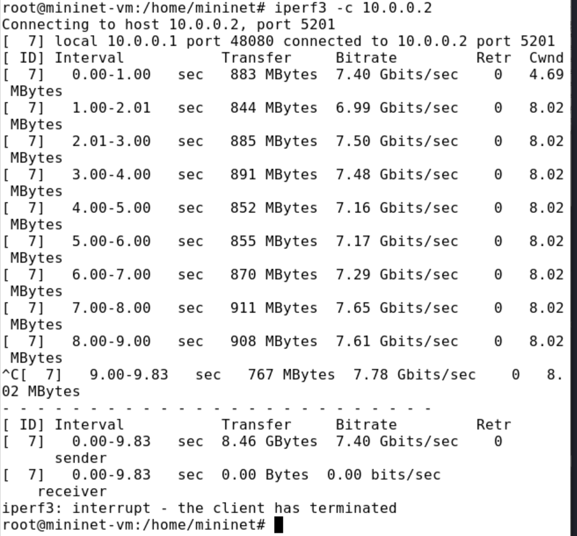
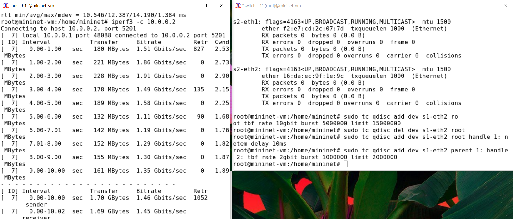
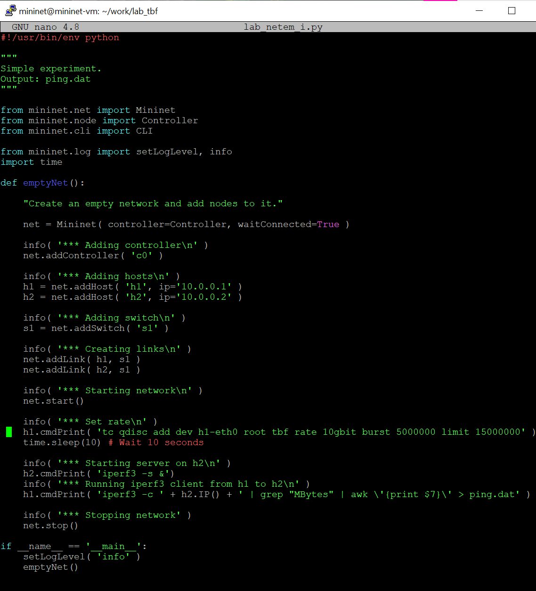

---
## Author
author:
  name: Ищенко Ирина Олеговна
  orcid: 0009-0002-0659-9651
  email: 1132226529@rudn.ru
  affiliation:
    - name: Российский университет дружбы народов
      country: Российская Федерация
      postal-code: 117198
      city: Москва
      address: ул. Миклухо-Маклая, д. 6
## Title
title: "Отчёт по лабораторной работе №6"
subtitle: "Моделирование сетей передачи данных"
license: "CC BY"
## Generic options
lang: ru-RU
number-sections: true
toc: true
toc-title: "Содержание"
toc-depth: 2
## Crossref customization
crossref:
  lof-title: "Список иллюстраций"
  lot-title: "Список таблиц"
  lol-title: "Листинги"
## Bibliography
bibliography:
  - bib/cite.bib
csl: _resources/csl/gost-r-7-0-5-2008-numeric.csl
## Formats
format:
### Pdf output format
  pdf:
    toc: true
    number-sections: true
    colorlinks: false
    toc-depth: 2
    lof: true # List of figures
    lot: false # List of tables
#### Document
    documentclass: scrreprt
    papersize: a4
    fontsize: 12pt
    linestretch: 1.5
#### Language
    babel-lang: russian
    babel-otherlangs: english
#### Biblatex
    cite-method: biblatex
    biblio-style: gost-numeric
    biblatexoptions:
      - backend=biber
      - langhook=extras
      - autolang=other*
#### Misc options
    csquotes: true
    indent: true
    header-includes: |
      \usepackage{indentfirst}
      \usepackage{float}
      \floatplacement{figure}{H}
      \usepackage[math,RM={Scale=0.94},SS={Scale=0.94},SScon={Scale=0.94},TT={Scale=MatchLowercase,FakeStretch=0.9},DefaultFeatures={Ligatures=Common}]{plex-otf}
### Docx output format
  docx:
    toc: true
    number-sections: true
    toc-depth: 2
---

# Цель работы

Основной целью работы является знакомство с принципами работы дисциплины очереди Token Bucket Filter, которая формирует входящий/исходящий
трафик для ограничения пропускной способности, а также получение навыков
моделирования и исследования поведения трафика посредством проведения
интерактивного и воспроизводимого экспериментов в Mininet.

# Задание

1. Задайте топологию, состоящую из двух хостов и двух коммутаторов
с назначенной по умолчанию mininet сетью 10.0.0.0/8.
2. Проведите интерактивные эксперименты по ограничению пропускной способности сети с помощью TBF в эмулируемой глобальной сети.
3. Самостоятельно реализуйте воспроизводимые эксперимент по применению
TBF для ограничения пропускной способности. Постройте соответствующие
графики.

# Выполнение лабораторной работы

Зададим простейшую топологию, состоящую из двух хостов и коммутатора с назначенной по умолчанию mininet сетью 10.0.0.0/8. На хостах h1, h2 и на коммутаторах s1, s2 введем команду ifconfig, чтобы отобразить информацию, относящуюся к их сетевым интерфейсам и назначенным им IP-адресам. В дальнейшем при работе с NETEM и командой tc будут использоваться интерфейсы h1-eth0, h2-eth0, s1-eth2 ([@fig-001]). Проверим подключение между хостами сети ([@fig-002]).

{#fig-001 width=70%}

{#fig-002 width=70%}

Запустим iPerf3 на хостах и посмотрим результат отработки на данном этапе ([@fig-003]).

{#fig-003 width=70%}

Изменим пропускную способность хоста h1, установив пропускную способность на 10 Гбит/с на интерфейсе h1-eth0 и параметры TBF-фильтра ([@fig-004]). Проверим ([@fig-005]).

{#fig-004 width=70%}

{#fig-005 width=70%}

Применим правило ограничения скорости tbf с параметрами rate = 10gbit, burst = 5,000,000, limit= 15,000,000 к интерфейсу s1-eth2 коммутатора s1, который соединяет его с коммутатором s2 ([@fig-006]).

{#fig-006 width=70%}

Объединим NETEM и TBF, введя на интерфейсе s1-eth2 коммутатора s1 задержку, джиттер, повреждение пакетов и указав скорость. Добавим второе правило на коммутаторе s1, которое задаёт ограничение скорости с помощью tbf с параметрами rate=2gbit, burst=1,000,000, limit=2,000,000: и проверим ([@fig-007]) и ([@fig-008]).

{#fig-007 width=70%}

{#fig-008 width=70%}

В виртуальной среде mininet в своём рабочем каталоге с проектами создадим каталог simple-tbf и перейдем в него. Создадим скрипт для эксперимента lab_netem_iii.py ([@fig-009]).

{#fig-009 width=70%}

Создадим также скрипт для визуализации ping_plot результатов эксперимента ([@fig-010]).

{#fig-010 width=70%}

Создадим также скрипт для визуализации ping_plot результатов эксперимента ([@fig-011]).

{#fig-011 width=70%}

Получим следующий график ([@fig-012]).

{#fig-012 width=70%}

# Выводы

В ходе выполнения лабораторной работы я познакомилась с принципами работы дисциплины очереди Token Bucket Filter, которая формирует входящий/исходящий трафик для ограничения пропускной способности, а также получила навыки
моделирования и исследования поведения трафика посредством проведения
интерактивного и воспроизводимого экспериментов в Mininet.
